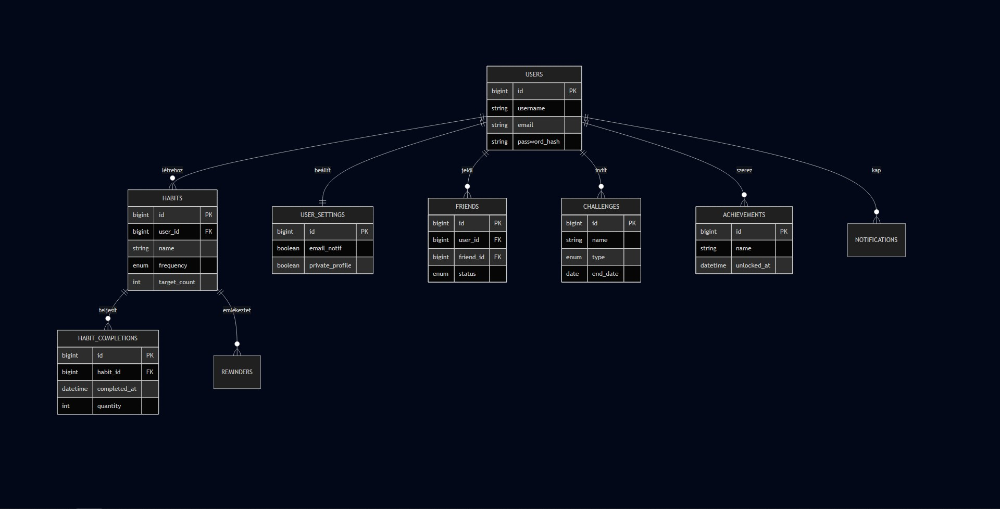

# STEAD-E – Szokás Követő

## 📖 Bevezetés és Projekt vízió
A **STEAD-E** egy modern, platformfüggetlen egészségfigyelő alkalmazás. A projekt alapötletét a *Wall-E* című film disztópikus jövőképe inspirálta: célunk megelőzni, hogy az emberek a technológia kényelme miatt elveszítsék fizikai fittségüket.

A piaci standardokkal ellentétben (pl. Samsung Health) a STEAD-E nem a versenysportra és a teljesítménykényszerre fókuszál, hanem **motivációs társként** segíti a felhasználót a fenntartható, egészséges szokások kialakításában.

---

## 🚀 Főbb funkciók
A rendszer kliens-szerver architektúrában működik, az alábbi szolgáltatásokat nyújtva:

* **🔐 Felhasználókezelés:** Biztonságos regisztráció, bejelentkezés és profilkezelés (célok, testsúly, magasság).
* **📊 Aktivitáskövetés (Habit Tracking):**
    * Szokások felvétele (pl. "Napi 2L víz", "30 perc séta").
    * Napi teljesítések naplózása.
* **📈 Statisztika:** Grafikus visszajelzés a fejlődésről (heti/havi nézet).

---

## 🛠 Technológiai Stack

A fejlesztés során a **Tiszta Kód (Clean Code)** elveit és a **RESTful** architektúrát követtük.

### Backend (Szerver oldal)
* **Nyelv:** PHP 8.2+
* **Keretrendszer:** **Laravel 10**
* **Adatbázis:** MySQL 8.0
* **API:** RESTful JSON válaszokkal

### Kliens oldali alkalmazások
1.  **Mobil App:**
    * **Platform:** Android (Natív)
    * **Nyelv:** **Kotlin**
    * **Kommunikáció:** Retrofit (HTTP kliens)
2.  **Webes Felület:**
    * **Tech:** Laravel Blade + Bootstrap 
    * **Cél:** Adminisztráció és asztali felhasználás.

---

## 🗄 Adatbázis Modell
A rendszer relációs adatbázist használ. A főbb táblák és kapcsolataik:

*(A diagram a `docs/images` mappában található)*

**Főbb táblák:**
* `users`: Felhasználói adatok, jelszó hash, streak számlálók.
* `habits`: A felvett szokások definíciói.
* `habit_completions`: Naplózott tevékenységek (napló).
* `goals` : A felvett célkitúzések amihez adott habiteket lehet felvenni követésre
---

## 🔌 API Dokumentáció (Végpontok)
A backend és a kliensek közötti kommunikáció legfontosabb végpontjai:

| Metódus | Végpont | Leírás |
| :--- | :--- | :--- |
| **Habits** | | |
| `GET` | `/api/habits` | A felhasználó aktív szokásainak listázása |
| `POST` | `/api/habits` | Új szokás létrehozása |
| `PUT` | `/api/habits/{id}` | Meglévő szokás módosítása |
| `DELETE` | `/api/habits/{id}` | Szokás törlése |
| **Habit Completions** | | |
| `POST` | `/api/habit-completions` | Szokás teljesítésének rögzítése |
| `DELETE` | `/api/habit-completions/{habitId}/today/last` | A mai nap utolsó teljesítésének törlése |
| **Statistics & Home** | | |
| `GET` | `/api/statistics` | Statisztikák lekérdezése |
| `GET` | `/api/home?date=YYYY-MM-DD` | Kezdőoldal adatainak lekérdezése adott napra |

---

## 👥 Csapat és Munkamegosztás

A projektet 3 fős fejlesztői csapat valósította meg agilis módszertannal.

| Tag | Szerepkör | Felelősségi körök |
| :--- | :--- | :--- |
| **Tavas Tamara** | Frontend fejlesztő | UI/UX tervek, Dokumentáció. |
| **Dudás Balázs** | Backend fejlesztő | Laravel API fejlesztés, Adatbázis tervezés, Webes frontend. |
| **Kaba Nóra Rebeka** | Mobil fejlesztő | Android (Kotlin) applikáció fejlesztés, API integráció. |

**Használt eszközök:**
* GitHub (Verziókezelés)
* Trello (Feladatkezelés)
* Discord (Kommunikáció)
* Postman (API tesztelés)

---

### Mobil App (Android)
---
*A projekt a szoftverfejlesztő szakmai vizsga követelményeinek megfelelően készült. 2026.*