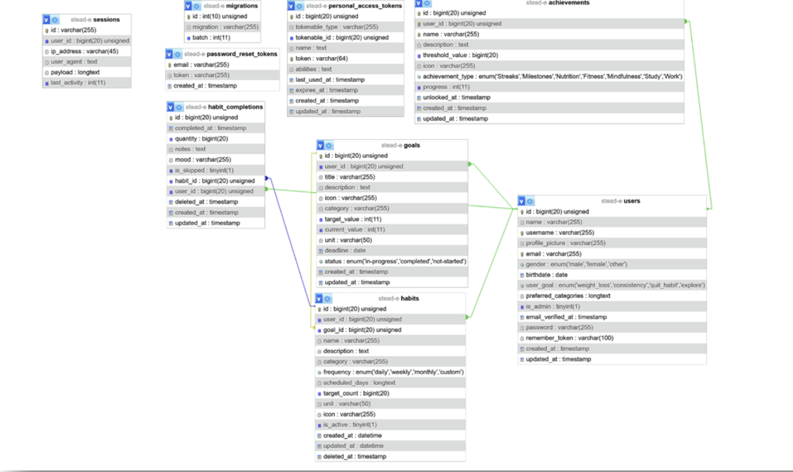

# STEAD-E – Habit Tracker

## Introduction & Project Vision

**STEAD-E** is a modern, cross-platform health monitoring application. The core idea was inspired by the dystopian future depicted in the movie *WALL-E* — our goal is to prevent people from losing their physical fitness due to the comfort of technology.

Unlike market standards (e.g., Samsung Health), STEAD-E does not focus on competitive sports or performance pressure. Instead, it acts as a **motivational companion**, helping users build sustainable, healthy habits.

---

## Key Features

The system operates in a client-server architecture, providing the following services:

- **User Management** — Secure registration, login, and profile management (goals, weight, height).
- **Activity Tracking (Habit Tracking)**
  - Add habits (e.g., "Drink 2L of water daily", "30-minute walk").
  - Log daily completions.
- **Statistics** — Visual feedback on progress (weekly/monthly view).

---

## Technology Stack

Development follows **Clean Code** principles and a **RESTful** architecture.

### Backend (Server Side)

| Component     | Technology        |
| :------------ | :---------------- |
| Language      | PHP 8.2+          |
| Framework     | Laravel 10        |
| Database      | MySQL 8.0         |
| API           | RESTful JSON      |

### Client Applications

**1. Mobile App**
- Platform: Android (Native)
- Language: Kotlin
- HTTP Client: Retrofit

**2. Web Interface**
- Tech: Laravel Blade + Bootstrap
- Purpose: Administration and desktop use.

---

## Database Model

The system uses a relational database. Main tables and their relationships:

| Table               | Description                                                                 |
| :------------------ | :-------------------------------------------------------------------------- |
| `users`             | User data, password hash, streak counters.                                  |
| `habits`            | Definitions of registered habits.                                           |
| `habit_completions` | Logged activities (journal).                                                |
| `goals`             | Defined goals to which specific habits can be added for tracking.           |

---

## API Documentation (Endpoints)

Key endpoints for communication between the backend and clients:

| Method   | Endpoint                                          | Description                                  |
| :------- | :------------------------------------------------ | :------------------------------------------- |
| `GET`    | `/api/habits`                                     | List the user's active habits                |
| `POST`   | `/api/habits`                                     | Create a new habit                           |
| `PUT`    | `/api/habits/{id}`                                | Modify an existing habit                     |
| `DELETE` | `/api/habits/{id}`                                | Delete a habit                               |
| `POST`   | `/api/habit-completions`                          | Record a habit completion                    |
| `DELETE` | `/api/habit-completions/{habitId}/today/last`     | Delete the last completion of today          |
| `GET`    | `/api/statistics`                                 | Retrieve statistics                          |
| `GET`    | `/api/home?date=YYYY-MM-DD`                       | Retrieve home page data for a given date     |

---

## Team & Responsibilities

The project was built by a 3-person development team using agile methodology.

| Member              | Role               | Responsibilities                                          |
| :------------------ | :----------------- | :-------------------------------------------------------- |
| **Tavas Tamara**    | Frontend Developer | UI/UX design, Documentation.                             |
| **Dudás Balázs**    | Backend Developer  | Laravel API development, Database design, Web frontend.  |
| **Kaba Nóra Rebeka** | Mobile Developer  | Android (Kotlin) app development, API integration.       |

**Tools Used:**

- GitHub — Version control
- Trello — Task management
- Discord — Communication
- Postman — API testing

---

*This project was created to meet the requirements of the software developer professional examination. 2026.*