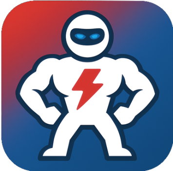

# Jelenlegi állapot (Március 2026. 03. 01.)

## Ami kész

- Teljes hitelesítési rendszer (bejelentkezés, regisztráció, jelszó-emlékeztető, email megerősítés)

- Kibővített felhasználói profilok (nem, születési dátum, súly, magasság, alvás/ébrenléti idő, célok)

- Adatbázis struktúra a users, habits és habit_completions táblákhoz

- Landing oldal (index.blade.php) a funkciók bemutatásával

- Dashboard UI alapváz (home.blade.php) navigációs elrendezéssel

- Laravel resource controller sablonok a Habits és HabitCompletions kezelésére

- Jogosultságkezelési policy sablonok (HabitPolicy, HabitCompletionPolicy)

- Űrlap validációs osztályok sablonjai

## Nincs kész / Befejezetlen

| Terület | Állapot |
|---------|---------|
| `HabitController` metódusok | Mind üresek – nincs mögöttes logika |
| `HabitCompletionController` metódusok | Mind üresek – nincs mögöttes logika |
| `HabitPolicy` | Minden metódus false-t ad vissza (mindent tilt) |
| `StoreHabitRequest` / `UpdateHabitRequest` | authorize() false-t ad vissza, a szabályok üresek |
| `habit_completions` migráció | Csak id és timestamp mezők – hiányoznak a kulcsfontosságú mezők |
| `HabitCompletion` modell | Nincsenek kapcsolatok vagy fillable tulajdonságok |
| `Routes (web.php)` | Nincsenek resource route-ok a habits vagy completions számára |

# Fejlesztés

## Dátum: 2026.03.12.

## Áttekintés
A statistics aloldal, illetve az achievements aloldal nem befejezett változata megírva. A test userhez 20 habits létrehozva factoryval. Illetve az adatbázis habits tábláján módosítás történt.

---

## Elvégzett feladatok

### 1. Adatbázis módosítások
- `habits` tábla módosítása: `is_public`, `colors` mezők el lettek távolítva, 
- Adatbázis újratöltése: `php artisan migrate:fresh --seed`
- 20 teszt habit generálva a factory használatával

### 3. Dashboard fejlesztések
- Statistics aloldal tartalma megírva, **nem befejezett**
- Achievements aloldal tartalma megírva, **nem befejezett**

